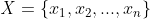
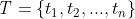
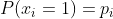
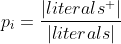
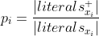
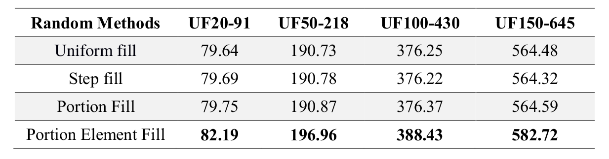
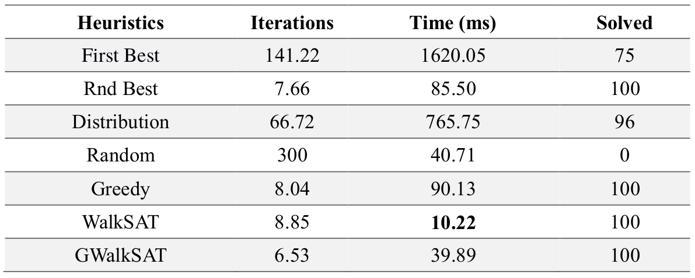

## Different heuristics and random initialization methods applied to GSAT and WalkSAT algorithm

### Introduction
This project focuses on GSAT and WalkSAT algorithms and their extensions which are particularly used to solve the Boolean satisfiability problem. The goal of this project is to compare the performances of the mentioned algorithms with different heuristics. The ability to find the model and the methods's running time are the two main comparison criteria which have been explored. Another important aspect of the project is the random initializations of the algorithms which turns out to be one significant factor for avoiding the local maxima. Different random initialization methods are discussed and compared in this report altogether with their implementational details. 

### Methods
#### Random Initialization
Let’s consider the random initialization method first. The variables of a Boolean expression
 can be seen as independent Bernoulli random variables, and a random
initialization method assign a random truth assignment  to the variables. The
probability of assigning a true value to the i-th variable of the formula is: 

 

 Having that said, different methods are modeled as follows:

* **Uniform Fill:** p i is equal to 0.5 for all of the variables.
This method uniformly fills the variables with truth assignments, hence, the probability of
having true and false are equal.
* **Step Fill:** p i is equal to 0 at first then increases after each iteration for all of the variables.
This method starts with zero probability of having a true assignment and goes to one over
time.
* **Portion Fill:** 
   This method fills the variables according to proportion of the positive literals that occur in
the whole formula
* **Portion Element Fill:** 
  This method fills each variable according to the proportion of the positive literal of that
variable that occurs in the formula.

#### Heuristics 
Now let’s consider the different heuristic exploring methods that have the huge impact on the
algorithm performance:
* **First Best:** selects the first best variable to flip according to its reward value.
* **Random Best:** randomly selects from the best variables with equal reward values.
* **Distribution:** Calculate a discrete random distribution from the variables’ reward function
then selects a variable by sampling from that distribution.
* **Random:** randomly selects from the variables, regardless of their reward value.
* **Greedy:** with the probability of the greedy factor selects between the Random Best and the
Distribution method.
* **WalkSAT:** select the variable according to the WalkSAT algorithm.
* **GWalkSAT:** with the probability of GWalk factor selects between the Random Best and
WalkSAT method.

### Results
The input of the program is the CNF formula encoded in DIMACS format taken from SATLIB-Benchmark Problems.
The results of the random initialization experiment on different sets are shown in the following table.

One of the results for the different heuristic methods are shown in the following table (UF20-91 dataset, 20 variables, 91 clauses, 100 instances).

### How to Run 
You can use the prebuilt binary file or compile the source files using the make command.
To run the benchmarks, choose the heuristic algorithm (by uncommentig the specified algorithm in the batch files), and run the batch file using the shell.
